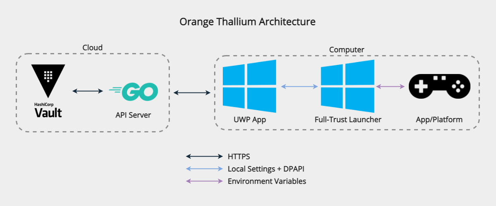

# Orange Thallium (Server)


[](https://github.com/bmhs-tsa/orange-thallium-server/actions)
[](https://github.com/bmhs-tsa/orange-thallium-server/actions)


An esports credential management system. This repository is the server, the client
can be found [here](https://github.com/bmhs-tsa/orange-thallium-client).

## Architecture


## Usage

### Starting the server
1. Install [Hashicorp Vault](https://www.vaultproject.io/docs/install)
2. Configure your OpenID server (Make sure user roles are set in the identity tokens)
3. Configure the server via **one** of the below methods:
   1. Config file
      1. Copy [`default.toml`](config/default.toml) to `local.toml` (In the same directory)
      2. Update `local.toml`
      3. If you're using Docker, make sure the container can access `local.toml`
   2. Environment variables
      1. Set environment variables to modify the values in [`default.toml`](config/default.toml) (`USE_ALL_CAPS_SNAKE_CASE.WITH_DECIMALS_FOR_NESTED_KEYS`)
4. Start the server via **one** of the below methods:
   1. If running on bare metal, build the server with `go build .` (From the project root) and manually execute it
   2. If running on Docker, use the `ghcr.io/bmhs-tsa/orange-thallium-server:latest` image

### Adding a credential
1. In the Vault, create a secret with the path you specified in the config file;
use the below JSON as a template:
```json
{
  "[Account ID]": {
    "username": "[Account username]",
    "password": "[Account password]",
     //Optional
    "mfa": {
       "type": "[MFA type]", //"hotp" or "totp"
       "secret": "[MFA secret]",
       "counter": 0 //Only for hotp
    }
  }
}
```
2. Update the Orange Thallium client with the same account ID you specified in Vault
3. Restart the client, authenticate with OpenID, and launch the configured app/platform

### Updating a credential
1. In Vault, update the username/password (Keep the account ID the same so you
don't have to update computers too)
2. If users immediately experience problems, have them restart the app they were
using through the Orange Thallium client (Which will automatically retrieve the 
latest credentials)

### Deleting a credential
1. In Vault, remove the corresponding account entry
2. Change the credential (In case it was exposed)

## Security

### Hardening
It's **strongly recommended** to harden your Orange Thallium server. To
do so, perform **each and every** of the below processes:
Process | Reason
--- | ---
Rotate **all** eSport credentials at least once per month | Invalidates previously exposed credentials
Block all non HTTPS traffic (`443/tcp`) | Reduce attack surface
Use a CA-signed TLS certificate | Prevents self-signed [MiTM attacks](https://wikipedia.org/wiki/Man-in-the-middle_attack)
Harden your Vault instance (Follow [this guide](https://learn.hashicorp.com/tutorials/vault/production-hardening)) | Prevents attackers directly exposing credentials from Vault

*This hardening guide only applies to the server, see [this guide](https://github.com/bmhs-tsa/orange-thallium-client#hardening) for the client.*

### Game Credentials
Orange Thallium encrypts and obfuscates credentials whenever possible; however
the end users can click the reveal-password button to expose the password.
Therefore, always treat the accounts as if they were compromised. Here's a table
of how credentials are protected in the various steps of Orange Thallium:

Step | Encryption | Description
--- | --- | ---
At rest | [Hashicorp Vault](https://vaultproject.io) | :heavy_check_mark: Secure as long as you harden Vault
In transit (Server <---> UWP app) | [TLS 1.3+](https://wikipedia.org/wiki/Transport_Layer_Security) | :heavy_check_mark: Secure as long as you use a CA-provided certificate
In transit (UWP app <---> full-trust launcher) | [Windows Data Protection API (DPAPI)](https://en.wikipedia.org/wiki/Data_Protection_API) | :heavy_check_mark: Secure as long as you don't use an identical client build on too many (100+) computers
In transit (Full-trust launcher <---> AutoHotkey scripts) | Environment Variable | :warning: Somewhat secure as long as users can't tamper with AutoHotkey scripts
In transit (AutoHotkey scripts <---> App) | None | :warning: Somewhat secure; the AutoHotkey scripts lock the mouse to prevent revealing passwords

## Development
These instructions are intended for developers only! Don't use them in production.

### TLS
If you're using a self-signed certificate and you keep getting errors, make sure
you've correctly specified the `Subject` and `Subject Alternative Name` (`SAN`)
fields; you can quickly verify this by accessing the API server in a browser,
if you don't see any TLS errors, you did this correctly. Also make sure your
certificate is installed in the **computer certificate store**, not the
**user-specific certificate store**; this will not be obvious using the 
aforementioned browser test.


### Vault
You'll need a [Vault](https://vaultproject.io) instance in order to work on 
this repository. To run Vault **in development mode**, run the below command:
```bash
docker run -d -p 8200:8200/tcp --cap-add=IPC_LOCK -e 'VAULT_DEV_ROOT_TOKEN_ID=root' -e 'VAULT_LOCAL_CONFIG={\"ui\": true}' --name=vault vault
```
